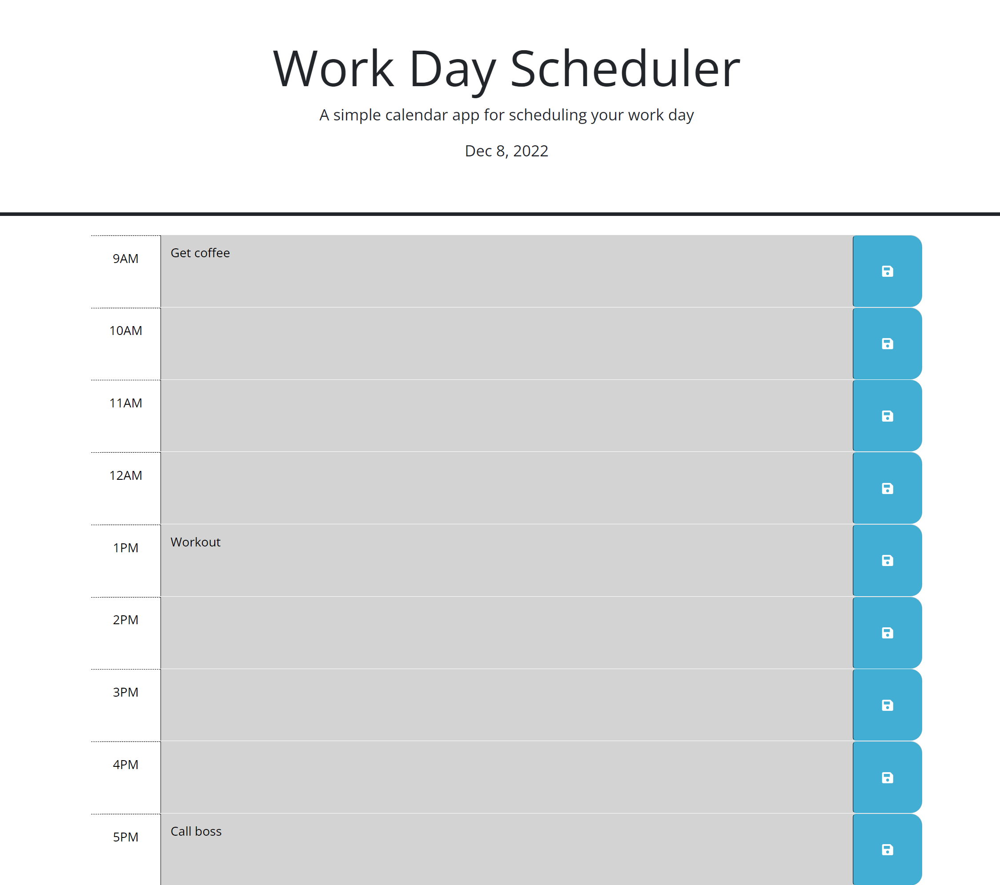

# work-day-scheduler

[Link to my Project https://elijahnance.github.io/work-day-scheduler/](https://elijahnance.github.io/work-day-scheduler/)

## Table of Contents
- [Description]
- [Visuals]

## Description
This is an interactive schedular built with JavaScript. The user is able to save there inputs and can come back later and it will still be there. The blocks of time chamge color depending on the time of day. The current date is displayed at the top of the page.

## Visuals
